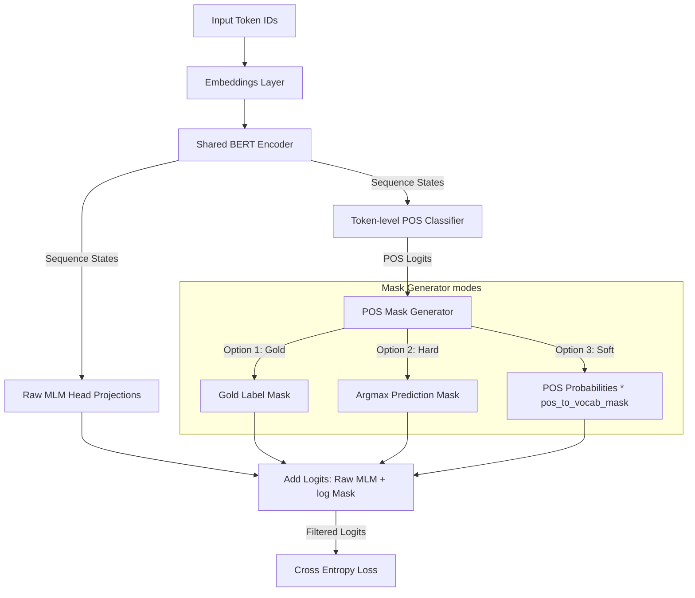

# Pretraining Architectures & Modeling Approach: BabyLM Challenge

This document provides a comprehensive overview of the model architectures implemented in this suite for the **BabyLM 2026 Challenge (Strict-Small track)**. We detail our two core classes, the multi-task and layered configurations, along with mathematical formulations, Mermaid diagrams, and example-driven explanations.

---

## 1. Core Architecture Overview

To train a highly performant `BERT-Mini` model (6 layers, 8 heads, 256 hidden dimension) under strict low-resource constraint limits (10M tokens), we implemented two primary neural network model designs:

1. **[`MultiTaskBERT`](file:///dss/dsshome1/08/ge87ves2/desktop/BabyLM_Challenge/src/models.py#L22)**: Trains baseline encoders with multiple parallel pretraining heads (MLM, NSP, and word-level Part-of-Speech classification).
2. **[`LayeredPOSMLMBert`](file:///dss/dsshome1/08/ge87ves2/desktop/BabyLM_Challenge/src/models.py#L173)**: Integrates POS predicting output probability vectors directly into the Masked Language Modeling (MLM) head's final vocabulary projection layer to filter out grammatically incorrect token predictions.

---

## 2. MultiTaskBERT Architecture

### Description
The MultiTaskBERT model runs a single shared `BertModel` encoder block to produce sequence hidden representations. It branches into three parallel task heads:
- **Masked Language Modeling (MLM)**: A linear-projection prediction head with tied weights to reconstruct masked subword tokens.
- **Next Sentence Prediction (NSP)**: A classification head predicting if two sentences are contiguous.
- **Part-of-Speech (POS) Tagging**: A classification head predicting POS tags. 

#### Word-Level average pooling
POS tagging is labeled at the word level, but BERT works on WordPiece subword tokens. To align representations, MultiTaskBERT implements a custom **Subword-to-Word Average Pooling Layer**:
1. During collation, a sequence mapping maps each subword token index to its parent word index.
2. A sparse pooling matrix $P \in \mathbb{R}^{\text{MaxWords} \times \text{SeqLen}}$ is constructed where:
   $$P_{i, j} = \frac{1}{\text{number of subwords in word } i} \quad \text{if subword } j \text{ belongs to word } i, \text{ else } 0$$
3. Batched matrix multiplication is performed on sequence states $S \in \mathbb{R}^{\text{SeqLen} \times \text{HiddenSize}}$:
   $$\text{PooledWordStates} = P \times S \quad \in \mathbb{R}^{\text{MaxWords} \times \text{HiddenSize}}$$

### Mermaid Diagram
```mermaid
graph TD
    Input[Input Token IDs] --> Embed[Embeddings Layer]
    Embed --> Enc[Shared BERT Encoder]
    Enc -->|Sequence States [B, L, H]| MLM[MLM Prediction Head]
    Enc -->|Pooler State [B, H]| NSP[NSP Head]
    Enc -->|Sequence States [B, L, H]| Pooling[Subword Average Pooling Matrix P]
    Pooling -->|Word States [B, W, H]| POS[POS Tagging Head]
    
    MLM -->|Logits| OutMLM[MLM Cross Entropy Loss]
    NSP -->|Logits| OutNSP[NSP Cross Entropy Loss]
    POS -->|Logits| OutPOS[POS Cross Entropy Loss]
```

### Example-Driven Explanation
Consider the sentence: **"the cats jumped."**
- **WordPiece Tokenization**: `["the", "cats", "jump", "##ed", "."]`
- **POS Ground Truth Labels**: `[DT, NNS, VBD, .]` (4 tags corresponding to: "the", "cats", "jumped", ".")
- **Word ID Mapping**:
  - `"the"` (subword index 0) -> Word ID `0`
  - `"cats"` (subword index 1) -> Word ID `1`
  - `"jump"` (subword index 2) -> Word ID `2`
  - `"##ed"` (subword index 3) -> Word ID `2`
  - `"."` (subword index 4) -> Word ID `3`

The pooling matrix $P$ will be constructed as:
$$P = \begin{pmatrix} 
1 & 0 & 0 & 0 & 0 \\ 
0 & 1 & 0 & 0 & 0 \\ 
0 & 0 & 0.5 & 0.5 & 0 \\ 
0 & 0 & 0 & 0 & 1 
\end{pmatrix}$$
Multiplying $P$ with the sequence output vectors averages the hidden states of `"jump"` and `"##ed"` to form a single representation for the word **"jumped"** at Word ID `2`, which is then projected to predict the `VBD` POS tag.

---

## 3. LayeredPOSMLMBert Architecture

### Description
Instead of treating POS classification as an independent parallel task, the **Layered POS model** restricts MLM vocabulary outputs. It runs a token-level POS classifier first, maps the predicted POS tag to a subset of allowed token IDs using a compiled matrix `pos_to_vocab_mask`, and overlays this mask onto the MLM softmax logits.

The MLM Logits are calculated as:
$$\text{MaskedMLMLogits} = \text{RawMLMLogits} + \log(M + \epsilon)$$
where $M$ is the vocabulary filter mask. We support three masking modes:

1. **Gold Masking** (Training Only):
   Uses the ground-truth POS tags to select the vocabulary subset.
   $$M = \text{pos\_to\_vocab\_mask}[\text{gold\_pos\_label}]$$
2. **Hard Masking**:
   Takes the `argmax` index of the predicted POS distribution.
   $$\hat{t} = \text{argmax}(\text{pos\_logits})$$
   $$M = \text{pos\_to\_vocab\_mask}[\hat{t}]$$
3. **Soft Masking** (Differentiable):
   Performs a matrix multiplication of the POS probability distribution vector with the mask matrix:
   $$P_{\text{pos}} = \text{Softmax}(\text{pos\_logits})$$
   $$M = P_{\text{pos}} \times \text{pos\_to\_vocab\_mask} \quad \in \mathbb{R}^{\text{SeqLen} \times \text{VocabSize}}$$

### Mermaid Diagram


### Example-Driven Explanation
Consider predicting a masked word: **"the [MASK] sat on the mat."**
The correct word is a noun (e.g., "cat").
1. The shared encoder processes the sequence and outputs a vector for the `[MASK]` token.
2. The POS Classifier projects this vector and outputs logits for the 45 POS categories. The highest logit corresponds to `NN` (Noun, singular).
3. The model loads the pre-compiled `pos_to_vocab_mask` from `data/pos_to_vocab.json`. In this map:
   - POS `NN` allows tokens like `"cat"`, `"dog"`, `"house"`, etc.
   - POS `NN` *forbids* tokens like `"sat"` (verb), `"happy"` (adjective), or `"under"` (preposition).
4. **Hard Masking**: The mask vector for `NN` contains `1.0` for allowed tokens and `0.0` for forbidden ones. Adding $\log(\text{mask})$ drops the logit values of all non-noun tokens (e.g. `"sat"`, `"happy"`) to $-\infty$. This guarantees that the final MLM softmax layer can only select nouns.
5. **Soft Masking**: If the POS head assigns $0.8$ probability to `NN` and $0.2$ probability to `JJ` (Adjective), the vocabulary mask is a weighted average: $0.8 \times \text{mask}_{NN} + 0.2 \times \text{mask}_{JJ}$. This retains grammatical flexibility during training backpropagation.

---

## 4. Summary of Model Configurations

The pipeline configures the following ablation models using combinations of the two architectures:

| Model Name | Underlying Architecture | Pretraining Tasks | Loss Formula | Purpose / Ablation Focus |
| :--- | :--- | :--- | :--- | :--- |
| **`BASEBERT`** | `MultiTaskBERT` | MLM, NSP | $L_{MLM} + L_{NSP}$ | Baseline BERT-Mini standard configuration. |
| **`POSBERT`** | `MultiTaskBERT` | POS | $L_{POS}$ | Examines learning representations using syntax tags alone. |
| **`MLMPOSBert`** | `MultiTaskBERT` | MLM, POS | $L_{MLM} + L_{POS}$ | Standard multi-task syntax and semantics pretraining. |
| **`NSPPOSBERT`** | `MultiTaskBERT` | NSP, POS | $L_{NSP} + L_{POS}$ | Baseline testing syntax + sentence relationship representations. |
| **`MLM_POS_NSPBERT`** | `MultiTaskBERT` | MLM, NSP, POS | $L_{MLM} + L_{NSP} + L_{POS}$ | Complete multi-task setup. |
| **`MLM_ONLY`** | `MultiTaskBERT` | MLM | $L_{MLM}$ | Evaluates MLM-only syntax/semantics baseline. |
| **`MLMPOS_alpha02`** | `MultiTaskBERT` | MLM, POS | $L_{MLM} + 0.2 L_{POS}$ | Multi-task pretraining with a smaller scaling factor for POS. |
| **`MLMPOSNSP_alpha02`**| `MultiTaskBERT` | MLM, NSP, POS | $L_{MLM} + L_{NSP} + 0.2 L_{POS}$ | Complete multi-task setup with downweighted POS loss. |
| **`LAYERED_POS_MLM_SOFT`**| `LayeredPOSMLMBert` | MLM, POS | $L_{MLM} + L_{POS}$ | Layered approach utilizing differentiable Soft probability masks. |
| **`LAYERED_POS_MLM_HARD`**| `LayeredPOSMLMBert` | MLM, POS | $L_{MLM} + L_{POS}$ | Layered approach utilizing discrete Hard argmax masks. |
| **`LAYERED_POS_MLM_GOLD`**| `LayeredPOSMLMBert` | MLM, POS | $L_{MLM} + L_{POS}$ | Layered approach utilizing ground-truth POS tags during training. |

---

## 5. Rationale: Why These Approaches & Evaluations Make Sense

### Rationale Behind the Modeling Approaches

#### 1. Baseline Reference Models (`MLM_ONLY`, `BASEBERT`)
- **Why they make sense:** They establish the performance floor and ceiling for standard BERT training without auxiliary syntax. They isolate whether multi-task learning or layered masking yields actual improvements over standard MLM.

#### 2. Parallel Syntax Models (`POSBERT`, `MLMPOSBert`, `MLM_POS_NSPBERT`)
- **Why they make sense:** In low-resource settings (10M tokens), standard models struggle to acquire fine-grained grammatical structure. Forcing the encoder to predict word-level POS tags shifts the hidden representations to encode syntactic features explicitly.

#### 3. Loss Scaling Ablations ($\alpha = 0.2$ vs $\alpha = 1.0$)
- **Why they make sense:** POS tagging is a relatively simple token classification task compared to MLM. If $\alpha = 1.0$, POS gradients can dominate early training, causing the shared base encoder parameters to overfit to syntactic classification at the expense of learning general semantic contexts. Down-weighting POS loss ($\alpha = 0.2$) helps find a balanced gradient convergence.

#### 4. Layered Vocabulary Reduction (`LAYERED_POS_MLM_SOFT` / `HARD` / `GOLD`)
- **Why they make sense:** Predicting 1-out-of-30,522 tokens is a high-entropy search space. By layering POS predictions first, we filter out tokens that are grammatically invalid for the target slot:
  - **GOLD** establishes an empirical upper bound, isolating how much MLM improves if POS tags were predicted perfectly.
  - **HARD** simulates runtime inference, checking if discrete syntactic constraint filtering helps semantic token recovery under realistic model error rates.
  - **SOFT** makes the restriction differentiable, letting the MLM cross-entropy loss backpropagate directly into the POS classifier to co-tune both heads.

---

### Rationale Behind the Evaluation Suite

To comprehensively measure representation quality, our evaluations span linguistic, semantic, and generative benchmarks:

1. **Pseudo-Perplexity (WikiText-2 / BabyLM Val)**:
   - Measures sequence probability fluency. Lower perplexity demonstrates that the model represents token distributions correctly.
2. **BLiMP (Linguistic Minimal Pairs)**:
   - Zero-shot grammatical tests (e.g. checking if the model assigns higher probability to *"the cat eats"* than *"the cat eat"*). This isolates syntactic knowledge, verifying whether POS pretraining translates to robust grammatical understanding.
3. **GLUE Tasks (CoLA, SST-2, MRPC)**:
   - Downstream classifier fine-tuning. Evaluates representation utility on sequence-level classification (sentiment, grammar acceptability, paraphrase identification).
4. **BLEU (Multi30k Machine Translation)**:
   - Fine-tunes the model as a sequence-to-sequence translation encoder. Evaluates if the learned representations support generative language transfer and sentence structure preservation.

