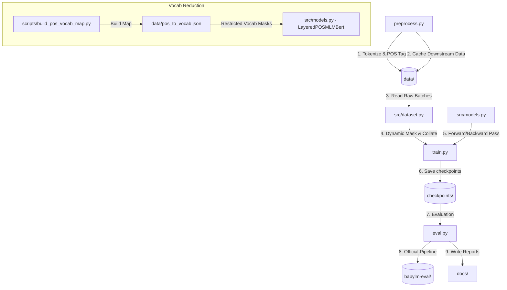

# BabyLM Multi-Task BERT & Layered Vocabulary Reduction: Repository Walkthrough

Welcome to the comprehensive developer walkthrough of the **BabyLM Multi-Task BERT Pretraining & Evaluation Suite**. This repository contains a complete, optimized pipeline tailored for training and evaluating small-scale BERT models under the constraints of the **BabyLM 2026 Challenge (Strict-Small track)**.

In addition to standard pretraining (Masked Language Modeling, Next Sentence Prediction), this repository implements a state-of-the-art **Layered POS Vocabulary Reduction** architecture. This technique uses a predicting POS Tagging head to filter or constrain the output vocabulary distribution in the Masked Language Model's softmax projection layer, limiting it to words that share the predicted Part-of-Speech category.

---

## 🗺️ Repo Architecture Diagram



---

## 📂 Core Subdirectories & Detailed Navigations

Each directory in this repository has its own detailed `AGENTS.md` file explaining component-specific implementations.

1. **[`src/`](file:///dss/dsshome1/08/ge87ves2/desktop/BabyLM_Challenge/src/AGENTS.md)**: Contains the core dataset loading, collation, and neural network model architectures.
   - **[`src/dataset.py`](file:///dss/dsshome1/08/ge87ves2/desktop/BabyLM_Challenge/src/dataset.py)**: Dynamic masking, sentence pairing (NSP), and WordPiece-to-POS-tag word-level alignment helpers.
   - **[`src/models.py`](file:///dss/dsshome1/08/ge87ves2/desktop/BabyLM_Challenge/src/models.py)**: Standard BERT-Mini encoder, MultiTask heads (MLM, NSP, POS), and the `LayeredPOSMLMBert` architecture.
2. **[`scripts/`](file:///dss/dsshome1/08/ge87ves2/desktop/BabyLM_Challenge/scripts/AGENTS.md)**: Automation shell jobs and utility scripts.
   - **[`scripts/build_pos_vocab_map.py`](file:///dss/dsshome1/08/ge87ves2/desktop/BabyLM_Challenge/scripts/build_pos_vocab_map.py)**: Compiles POS tag-to-vocabulary token ID relationships from the preprocessed training dataset corpus.
   - **[`scripts/convert_checkpoints.py`](file:///dss/dsshome1/08/ge87ves2/desktop/BabyLM_Challenge/scripts/convert_checkpoints.py)**: Formats checkpoint weights into standard HuggingFace `PreTrainedModel` format for external testing/uploads.
   - **[`scripts/summarize_results.py`](file:///dss/dsshome1/08/ge87ves2/desktop/BabyLM_Challenge/scripts/summarize_results.py)**: Formatter to aggregate eval results across different checkpoints.
3. **[`tests/`](file:///dss/dsshome1/08/ge87ves2/desktop/BabyLM_Challenge/tests/AGENTS.md)**: Dedicated test suite.
   - **[`tests/verify_pipeline.py`](file:///dss/dsshome1/08/ge87ves2/desktop/BabyLM_Challenge/tests/verify_pipeline.py)**: Unit and integration tests validating embedding dimensions, average pooling masks, and gradients.
   - **[`tests/verify_layered_pipeline.py`](file:///dss/dsshome1/08/ge87ves2/desktop/BabyLM_Challenge/tests/verify_layered_pipeline.py)**: Formulates mock test inputs to verify the layered pretraining configurations ("soft", "hard", "gold") and check backward gradients.
4. **[`docs/`](file:///dss/dsshome1/08/ge87ves2/desktop/BabyLM_Challenge/docs/AGENTS.md)**: Consolidated reports, mathematical writeups of the pipeline, developer guides, and tabular result summaries.
   - **[`docs/PipelineExplanation.md`](file:///dss/dsshome1/08/ge87ves2/desktop/BabyLM_Challenge/docs/PipelineExplanation.md)**: Deep-dive explanation detailing token processing, the mathematical mechanics of word pooling, multi-task objective equations, and layered POS masking logic.
   - **[`docs/developer_guide.md`](file:///dss/dsshome1/08/ge87ves2/desktop/BabyLM_Challenge/docs/developer_guide.md)**: Context configurations and development logs for developers/agents.
   - **[`docs/interactive/index.html`](file:///dss/dsshome1/08/ge87ves2/desktop/BabyLM_Challenge/docs/interactive/index.html)**: Interactive step-by-step animated visual lecture website explaining average pooling alignments and layered vocab reduction constraints.
5. **[`data/`](file:///dss/dsshome1/08/ge87ves2/desktop/BabyLM_Challenge/data/AGENTS.md)**: Tokenized training splits, vocab files (`pos_to_id.json`, `pos_to_vocab.json`), and cached NLTK tagger resources.
6. **[`Approach.md`](file:///dss/dsshome1/08/ge87ves2/desktop/BabyLM_Challenge/Approach.md)**: Detailed overview and diagrams explaining each model variant (ablation models, multi-task settings, and layered vocab masking configurations).

---

## ⚙️ Pipeline Lifecycle & Workflows

### Phase 1: Environment Setup
Dependencies are listed in `requirements.txt`.
```bash
python3 -m venv venv
source venv/bin/activate
pip install -r requirements.txt
```
To run zero-shot downstream evaluations, clone the external evaluation subproject:
```bash
git clone https://github.com/babylm/evaluation-pipeline-2024.git babylm-eval
pip install -r babylm-eval/requirements.txt
```

### Phase 2: Data Preprocessing
Run the preprocessing script to tokenize the BabyLM corpus and perform POS tagging (powered by `nltk.pos_tag`):
```bash
python preprocess.py
```
This downloads NLTK assets locally to `data/nltk_data/` and compiles tokenized chunks into `data/preprocessed_train/` and `data/preprocessed_val/`.

### Phase 3: Building POS Vocab Mapping (Layered Approach Only)
Before training a layered model, compute the allowed vocabulary per POS tag from token co-occurrences:
```bash
python scripts/build_pos_vocab_map.py
```
This outputs `data/pos_to_vocab.json` which maps each POS index to the subset of tokenizer token IDs observed with that tag in the training corpus.

### Phase 4: Model Pretraining
We support training models under various configurations (objectives combinations: `mlm`, `nsp`, `pos`).
```bash
# Standard MLM + POS Multi-task training
python train.py --tasks mlm,pos --model_dir ./checkpoints/mlmposbert --epochs 5 --batch_size 64
```
For layered POS pretraining, the training parameters support soft/hard/gold masking modes.

### Phase 5: Evaluation
Once checkpoints are generated, execute evaluations on WikiText-2 (Perplexity), BLiMP (grammatical understanding), and GLUE (downstream fine-tuning):
```bash
python eval.py --checkpoint_path ./checkpoints/mlmposbert/checkpoint_best.pt --tasks perplexity,blimp,glue
```
Export checkpoints to HuggingFace standard config for submission:
```bash
python scripts/convert_checkpoints.py
```

### Phase 6: Orchestration
The primary driver script [`main.py`](file:///dss/dsshome1/08/ge87ves2/desktop/BabyLM_Challenge/main.py) automates the entire lifecycle: runs preprocessing, triggers pretraining of multiple ablation models, evaluates checkpoints, and aggregates results.
Submit via SLURM:
```bash
sbatch scripts/job_train_eval.sh
```

---

## 🔬 Core Algorithms & Explanations

### 1. POS Subword-level Average Pooling
Because POS tags are labeled at the word level but BERT tokenizes into subword pieces (WordPiece), we employ a custom index-based pooling mask:
- During collation, each token is mapped to its parent word index.
- A sparse-dense reduction matrix is constructed for each sequence.
- During the forward pass, subword embeddings are averaged using batched matrix multiplications (`torch.bmm`) to produce word-level embeddings.
- A linear classification projection predicts POS classes (45 Penn Treebank categories) on these word-level representations.

### 2. Layered Vocab Reduction Masking
The layered architecture restricts the MLM prediction head to tokens corresponding to the predicted POS tags:
- **Gold Masking**: Masks the vocabulary using the ground-truth POS tags.
- **Hard Masking**: Predicts the POS tags using the POS head, takes the argmax prediction, and restricts the MLM vocabulary to the tokens mapped to that predicted POS tag.
- **Soft Masking**: Projects the POS tag probabilities to the vocabulary space, scaling or masking the MLM softmax logit scores dynamically during backpropagation.

For complete mathematical definitions and loss derivations, check out the [`docs/PipelineExplanation.md`](file:///dss/dsshome1/08/ge87ves2/desktop/BabyLM_Challenge/docs/PipelineExplanation.md) document.
