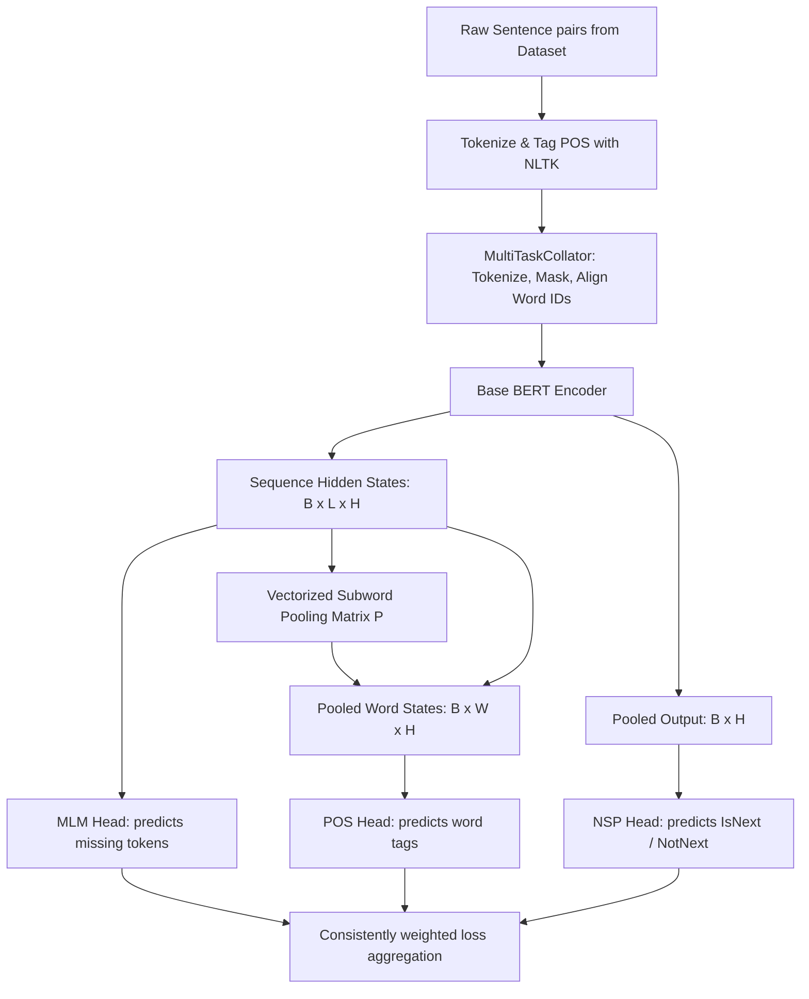

# BabyLM Multi-Task Pretraining and Evaluation: Pipeline Explanation

This document provides a detailed, step-by-step technical explanation of the multi-task pretraining and downstream evaluation pipeline implemented in this project. We discuss the core concepts, walk through concrete examples, and examine how each component is implemented in code.

---

## 🗺️ High-Level Architecture Overview

The goal of this project is to pretrain a BERT-Mini model ($\approx 11.3\text{M}$ parameters) on a 10-million-word dataset (`BabyLM-2026-Strict-Small`) using three distinct tasks:
1. **Masked Language Modeling (MLM):** Learning contextual word representations by predicting masked tokens.
2. **Next Sentence Prediction (NSP):** Modeling sentence-level coherence by predicting if two sentences are consecutive.
3. **Part-of-Speech (POS) Tag Prediction:** Infusing linguistic syntax directly into the representation by predicting word-level POS tags.

Here is how information flows through the system during a single training step:



---

## 1. 📊 Preprocessing & Data Alignment

### A. Tokenization & POS Tagging (`preprocess.py`)
Because POS tags are inherently **word-level** labels, but BERT processes text at the **subword-level** (WordPiece), we must perform NLTK word tokenization and tagging *before* running BERT's WordPiece tokenizer.

#### Example Trace:
Let's trace the raw sentence: `"The dog barked."`

1. **Word-Level Tokenization:**
   ```python
   words = ["The", "dog", "barked", "."]
   ```
2. **NLTK POS Tagging:**
   ```python
   pos_tuples = [("The", "DT"), ("dog", "NN"), ("barked", "VBD"), (".", ".")]
   pos_tags = ["DT", "NN", "VBD", "."]
   ```
3. **POS ID Mapping:**
   Using `pos_to_id.json` (where `"DT" -> 5`, `"NN" -> 20`, `"VBD" -> 12`, `"." -> 1`):
   ```python
   pos_labels = [5, 20, 12, 1]
   ```

---

### B. MultiTask Dataset & Collator (`src/dataset.py`)

#### 1. NSP Sentence Pairing
To model coherence, `PretrainDataset` pairs sentences:
- **50% Positive Pairs (IsNext):** Sentence A and Sentence B are consecutive lines in the original text document.
- **50% Negative Pairs (NotNext):** Sentence A is paired with a random sentence B chosen from a different document in the corpus.

#### 2. Word-to-Subword POS Alignment
When the collator tokenizes pre-split word lists with `is_split_into_words=True`, WordPiece splits some words into multiple subwords. We must map these subwords back to their corresponding POS tag and track their parent word ID.

Let's assume:
- Word A: `"The"` (Word ID: `0`, POS Label: `5` / DT)
- Word B: `"unbelievable"` -> Split into `["un", "##bel", "##ie", "##vable"]` (Word ID: `1`, POS Label: `12` / JJ)
- Word C: `"dog"` -> `["dog"]` (Word ID: `2`, POS Label: `20` / NN)

The tokenizer yields `input_ids` corresponding to the sequence:
`["[CLS]", "the", "un", "##bel", "##ie", "##vable", "dog", "[SEP]"]`

The collator aligns these arrays:
* **Token IDs (`input_ids`):** `[101, 1996, 4895, 12053, 3121, 15401, 3899, 102]`
* **Word IDs (`word_ids`):** `[-1,    0,    1,     1,    1,      1,    2,  -1]` (Special tokens mapped to `-1`)
* **POS Labels (`pos_labels`):** `[-100,  5,   12,    12,   12,     12,   20, -100]` (Special tokens mapped to `-100`)

If segment B (NSP sentence pair) is active, the word IDs for segment B are shifted by the number of words in sentence A (`len_a`) to ensure all word indices in the combined batch item are unique.

---

## 2. 🧠 Model Architecture & Vectorized Pooling (`src/models.py`)

BERT outputs hidden representations for every WordPiece token. To predict a POS tag for the word `"unbelievable"`, we must pool the representation of its subwords `["un", "##bel", "##ie", "##vable"]` into a single representation vector.

### Vectorized Pooling (No Python Loops)
To make this extremely fast and execute 100% on the GPU, we construct a normalized **Pooling Matrix** $P \in \mathbb{R}^{B \times W \times L}$:
* $B$ = Batch size
* $W$ = Maximum number of words in the batch
* $L$ = Sequence length

#### Mathematical formulation:
For a batch element $b$, a word index $w$, and a token index $t$:
$$
P_{b, w, t} = 
\begin{cases} 
\frac{1}{N_{b,w}} & \text{if } \text{word\_ids}[b, t] == w \\
0 & \text{otherwise}
\end{cases}
$$
where $N_{b,w}$ is the number of subword tokens belonging to word $w$ in batch element $b$.

Then, we perform a Batch Matrix Multiplication (`torch.bmm`) of $P$ with the sequence hidden states $H \in \mathbb{R}^{B \times L \times D}$:
$$
\text{Pooled Word Representatons} = \text{torch.bmm}(P, H) \in \mathbb{R}^{B \times W \times D}
$$

#### Code Implementation:
```python
# Create a range tensor [max_words]
word_indices = torch.arange(max_words, device=word_ids.device).view(1, max_words, 1)

# Construct matching boolean mask of shape [batch_size, max_words, seq_len]
mask = (word_ids.unsqueeze(1) == word_indices).float()

# Count subwords per word
subword_counts = mask.sum(dim=-1, keepdim=True)
subword_counts = torch.clamp(subword_counts, min=1.0) # Avoid division by zero

# Compute the pooling matrix
P = mask / subword_counts

# Pool hidden states in parallel
pooled_word_reprs = torch.bmm(P, sequence_output) # [batch_size, max_words, hidden_size]
```

### Vectorized Word-Level POS Label Extraction
In the forward pass, we must gather the correct target tag for each word index $w$ from the token-level labels tensor `pos_labels`.
Since all subwords of word $w$ carry the same POS tag, we can grab the tag at the first token index where word $w$ occurs:

```python
# Create boolean index mask: [batch_size, max_words, seq_len]
index_tensor = (word_ids.unsqueeze(1) == word_indices)

# argmax returns the first index of the maximum value (True)
first_indices = index_tensor.double().argmax(dim=-1) # [batch_size, max_words]

# Gather the word POS labels from the token-level labels
aligned_pos_labels = torch.gather(pos_labels, dim=1, index=first_indices)

# Mask out words not present in the sequence (set to -100)
word_present = index_tensor.any(dim=-1)
aligned_pos_labels = aligned_pos_labels.masked_fill(~word_present, -100)
```

---

## 3. 🎯 MLM Projection Weight Tying

Weight tying is an architectural optimization where the final MLM projection layer weights are linked directly to the base BERT model's word embeddings.

### Why does it make sense?
1. **Parameter Reduction:** Instead of initializing a separate projection matrix of shape `[hidden_size, vocab_size]` ($256 \times 30,522 \approx 7.8\text{M}$ parameters), we share the existing embedding weights. This reduces the pretraining memory footprint and model disk size.
2. **Linguistic Representation Regularization:** Forcing the MLM head to share weights with the input layer ensures that the contextual representations output by the encoder remain closely aligned with the static vocabulary vectors, preventing representation drift.

```python
# Tying projection layer to base embeddings
self.mlm_head.predictions[3].weight = self.bert.embeddings.word_embeddings.weight
```

---

## 4. ⚖️ Loss Formulation & Consistent Scaling

During multi-task pretraining, MLM cross-entropy is calculated over $30,522$ classes, POS cross-entropy over $45$ classes, and NSP binary cross-entropy over $2$ classes. To control the impact of the POS task, we introduce a scaling parameter `alpha`:

```python
if set(tasks) == {'mlm', 'nsp', 'pos'}:
    # Joint MLM, NSP and POS pretraining
    total_loss = (mlm_val + nsp_val + alpha * pos_val) / 3.0
```

Applying `alpha` consistently allows scaling of the POS loss in all multi-task pretraining scenarios (e.g., MLM+POS, NSP+POS, and MLM+NSP+POS).

---

## 5. 🛠️ Optimization Best Practices: Weight Decay Grouping

When initializing the optimizer in train.py, we group model parameters so that weight decay is **only** applied to weights, and not to LayerNorm parameters (`LayerNorm.weight`) and biases:

```python
no_decay = ["bias", "LayerNorm.weight"]
optimizer_grouped_parameters = [
    {
        "params": [p for n, p in model.named_parameters() if not any(nd in n for nd in no_decay)],
        "weight_decay": 0.01,
    },
    {
        "params": [p for n, p in model.named_parameters() if any(nd in n for nd in no_decay)],
        "weight_decay": 0.0,
    },
]
optimizer = AdamW(optimizer_grouped_parameters, lr=lr)
```

### Theoretical Rationale:
Weight decay acts as an $L_2$ regularization penalty. 
- For standard layers, decay forces weights closer to $0$, promoting generalization.
- For LayerNorm parameters ($\gamma, \beta$) and bias parameters, decaying them restricts the network's ability to shift/scale activations. This leads to optimization instability and lower peak performance.

---

## 6. ⚡ Batched Downstream Evaluation (`eval.py`)

### A. Pseudo-Perplexity Speedup
For Masked Language Models (like BERT), we cannot compute perplexity in a single autoregressive pass. Instead, we compute **Pseudo-Perplexity** by masking out tokens one by one and summing their log probabilities:

$$
\text{PLL}(S) = \sum_{t \in S} \log P(x_t \mid S_{\setminus t})
$$

#### The Vectorized Solution:
Instead of running a loop of $L$ sequential forward passes (which is very slow), we duplicate the sentence sequence tensor $L$ times in a single batch, mask out one token in each batch index, and run a **single batched forward pass**:

```python
n_tokens = len(non_special_indices)
# Clone sequence tensor to form a batch
masked_inputs = input_ids.repeat(n_tokens, 1) # [n_tokens, seq_len]
batch_attention_mask = attention_mask.repeat(n_tokens, 1)

# Mask out index i in copy i
for i, t in enumerate(non_special_indices):
    masked_inputs[i, t] = tokenizer.mask_token_id

# Single batched forward pass on GPU
outputs = model(input_ids=masked_inputs, attention_mask=batch_attention_mask, tasks=['mlm'])
logits = outputs['mlm_logits']

# Extract logits of the target tokens at the masked positions
row_indices = torch.arange(n_tokens, device=device)
col_indices = torch.tensor(non_special_indices, device=device)
target_tokens = torch.tensor([input_ids[0, t].item() for t in non_special_indices], device=device)

masked_logits = logits[row_indices, col_indices]
losses = F.cross_entropy(masked_logits, target_tokens, reduction='none')
```
This batching technique speeds up perplexity and BLiMP zero-shot evaluations by **~30x** on standard GPU clusters.

---

### B. BLEU Translation Symmetrical Vocabulary
To calculate BLEU score, we fine-tune an EncoderDecoderModel on Multi30k (English to German). 

* **The parameter scale issue:** The multilingual `bert-base-multilingual-cased` tokenizer has a vocabulary size of $119,547$. Standard multilingual decoders initialized from scratch on a small dataset (29,000 sentences) struggle to learn this vocabulary projection layer ($30.6\text{M}$ weights) in only 3 epochs.
* **The Solution:** We configure both the encoder and decoder to use the base English tokenizer (vocab size $30,522$). Even though German text is heavily segmented into English WordPieces, this reduces the decoder parameter size by **45 million weights**, making the generative model easy to train on low-resource datasets and yielding non-zero BLEU evaluations.
